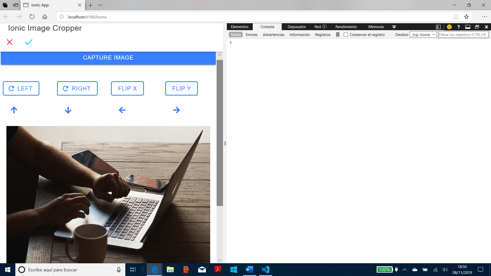

# :zap: Ionic Angular Image Crop

* App created using the [Ionic 5 framework](https://ionicframework.com/docs) to crop photos using an [Angular Image Cropper module](https://github.com/Mawi137/ngx-image-cropper).
* Another great tutorial from Simon Grimm at the [Ionic Academy](https://ionicacademy.com) - see [:clap: Inspiration](#clap-inspiration) below.

## :page_facing_up: Table of contents

* [:zap: Ionic Angular Image Crop](#zap-ionic-angular-image-crop)
  * [:page_facing_up: Table of contents](#page_facing_up-table-of-contents)
  * [:books: General info](#books-general-info)
  * [:camera: Screenshots](#camera-screenshots)
  * [:signal_strength: Technologies](#signal_strength-technologies)
  * [:floppy_disk: Setup](#floppy_disk-setup)
  * [:computer: Code Examples](#computer-code-examples)
  * [:cool: Features](#cool-features)
  * [:clipboard: Status & To-do list](#clipboard-status--to-do-list)
  * [:clap: Inspiration](#clap-inspiration)
  * [:envelope: Contact](#envelope-contact)

## :books: General info

* Uses the Cordova camera plugin, improved with the Ionic-native camera plugin.
* This is for development, a jpg image is used instead of the camera image.

## :camera: Screenshots



## :signal_strength: Technologies

* [Ionic v5](https://ionicframework.com/)
* [Angular v11](https://angular.io/)
* [Ionic/angular v5](https://www.npmjs.com/package/@ionic/angular)
* [Angular RxJS Library v6](https://angular.io/guide/rx-library)
* [ngx Image Cropper v3](https://github.com/Mawi137/ngx-image-cropper)

## :floppy_disk: Setup

* Run `npm i` to install dependencies
* To start the server on _localhost://8100_ type: 'ionic serve -o'

## :computer: Code Examples

* Extract from `home.page.ts` to show camera options

```typescript
const options: CameraOptions = {
    quality: 100,
    destinationType: this.camera.DestinationType.DATA_URL,
    encodingType: this.camera.EncodingType.JPEG,
    mediaType: this.camera.MediaType.PICTURE,
    sourceType: this.camera.PictureSourceType.CAMERA
}
```

## :cool: Features

* Crops and manipulates images using image cropper methods.

## :clipboard: Status & To-do list

* Status: Part-working. Compiles and displays but image not found in assets directory which prevents the image cropper from working.
* To-do: Fix issue with image path. Look at Ionic @ionic-native/crop/ngx to see the difference in how it crops images.

## :clap: Inspiration

* [Simon Grimm´s Youtube video: How to Crop Images in Ionic 4 with CropperJS](https://www.youtube.com/watch?v=UnqVkzWg2W0)
* [Nappd: How to add Image Cropper in ionic 4 app](https://enappd.com/blog/how-to-add-image-cropper-in-ionic-4-app/68/)
* [Adding Image Cropper in Ionic 4 Apps](https://medium.com/enappd/image-cropper-in-ionic-4-7b76f1153ad9)

## :envelope: Contact

* Repo created by [ABateman](https://www.andrewbateman.org) - you are welcome to [send me a message](https://andrewbateman.org/contact)
